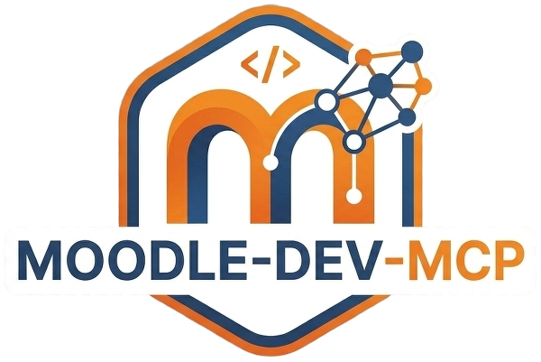
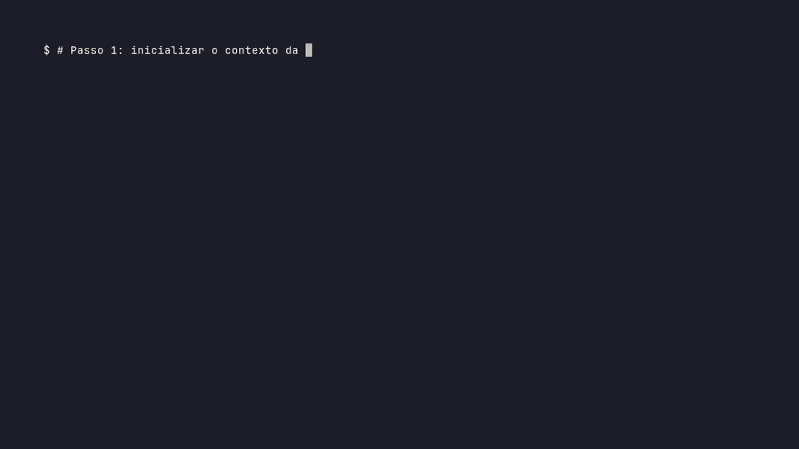

# moodle-dev-mcp 🎓🤖

<p align="center">
    
</p>

> **Transforme seu assistente de IA em um especialista em Moodle.**

> Servidor MCP que conecta assistentes de IA (Claude, Gemini e outros) diretamente à estrutura interna do Moodle para acelerar o desenvolvimento de plugins.

<p align="center">

[](https://www.npmjs.com/package/moodle-dev-mcp)
[](https://www.npmjs.com/package/moodle-dev-mcp)
[](https://nodejs.org)
[](./LICENSE)
[](https://modelcontextprotocol.io)
[](./CONTRIBUINDO.md)

</p>

🇺🇸 [Read in English](./README.md) | 📚 [Documentação Completa](./docs/pt-br/index.md)

---

## 🎬 Demonstração

<p align="center">
    
</p>

---

## 📑 Índice

- [O que é](#-o-que-é-o-moodle-dev-mcp)
- [Por que usar](#-por-que-usar)
- [Casos de uso](#-casos-de-uso)
- [Exemplo rápido](#-exemplo-rápido)
- [Arquitetura simplificada](#-arquitetura-simplificada)
- [Status do projeto](#-status-do-projeto)
- [Requisitos](#-requisitos)
- [Clientes MCP compatíveis](#-clientes-mcp-compatíveis)
- [Instalação](#-instalação)
- [Configuração do cliente MCP](#️-configuração-do-cliente-mcp)
- [Recursos disponíveis](#-recursos-disponíveis)
- [Segurança](#-segurança)
- [Documentação](#-documentação)
- [Contribuindo](#-contribuindo)
- [Autor](#-autor)
- [Licença](#-licença)

---

## 🚀 O que é o moodle-dev-mcp?

O **moodle-dev-mcp** conecta sua instalação Moodle local a assistentes de IA usando o **Model Context Protocol (MCP)**.

Ao invés de depender apenas do conhecimento genérico da IA sobre o Moodle, o servidor expõe automaticamente a estrutura real da sua instalação, incluindo:

- **APIs do Core:** funções, classes e bibliotecas nativas do Moodle.
- **Plugins instalados:** mapeamento completo de `local`, `mod`, `auth`, `block` e outros tipos.
- **Banco de dados:** estrutura de tabelas e definições de campos.
- **Ecossistema:** eventos, Hooks (Moodle 4.3+), Tasks e Capabilities.

---

## ✨ Por que usar?

### 🧠 Consciência real do código

A IA passa a conhecer **a sua instalação**, não um Moodle genérico. Ela detecta automaticamente a versão do Moodle em uso, os plugins já instalados e como as tabelas do banco de dados estão estruturadas — e usa esse contexto ao gerar ou revisar código.

### ⚡ Zero configuração no Moodle

Diferente de Web Services, você não precisa configurar tokens, criar usuários de serviço ou expor APIs. O servidor lê **diretamente os arquivos locais do sistema de arquivos**.

### 🔁 Integração natural no fluxo de desenvolvimento

Comandos em linguagem natural no chat da IA se traduzem em ações concretas: criar plugins, auditar código, consultar o banco de dados e muito mais — sem sair do seu editor.

---

## 💡 Casos de uso

| Cenário                    | O que você faz                            | O que o servidor entrega                                             |
| -------------------------- | ----------------------------------------- | -------------------------------------------------------------------- |
| **Novo plugin**            | Pede para criar um plugin do tipo `local` | Estrutura completa com `version.php`, `lang/`, `db/` e arquivos base |
| **Auditoria de segurança** | Solicita revisão de um plugin existente   | Análise focada nas convenções e APIs do Moodle real                  |
| **Consulta ao banco**      | Pergunta sobre a estrutura de uma tabela  | Retorna definição real do `install.xml` da sua instalação            |
| **Onboarding**             | Pede um mapa do ambiente                  | Relatório completo de versão, plugins e capacidades disponíveis      |

---

## ⚡ Exemplo rápido

Após configurar o servidor, você pode dar comandos em linguagem natural no chat da IA:

```
// 1. Inicializar o contexto do Moodle
"Mapeie meu ambiente Moodle e me dê um resumo."

// 2. Criar um plugin
"Crie um plugin local chamado 'minhas_ferramentas' com suporte a capabilities."

// 3. Auditar código
"Revise o plugin local_minhas_ferramentas com foco em segurança."
```

> Para uma lista completa de comandos, consulte a [Referência de Tools](./docs/pt-br/reference/tools.md).

---

## 🏗️ Arquitetura simplificada

```
Assistente de IA (Claude, Gemini...)
        │
        │  Model Context Protocol (MCP)
        ▼
┌─────────────────────────┐
│      moodle-dev-mcp     │
│  ┌───────────────────┐  │
│  │    Tools          │  │  ← Ações: scaffold, audit, busca na API...
│  │    Resources      │  │  ← Contexto: estrutura, plugins, DB
│  │    Prompts        │  │  ← Templates prontos para uso
│  └───────────────────┘  │
└──────────┬──────────────┘
           │  Leitura dos arquivos PHP + escrita de arquivos .md de contexto
           ▼
   Instalação local do Moodle
   /var/www/moodle (ou equivalente)
```

O servidor **nunca se comunica com servidores externos** e **nunca modifica arquivos PHP do Moodle**. Toda a análise é feita localmente. Os únicos arquivos escritos são os `.md` de contexto gerados dentro dos diretórios de plugin.

---

## 📊 Status do projeto

> **v1.2.0:** release estável com melhorias de segurança, correções de bugs e novas funcionalidades.

### O que há de novo na v1.2.0

- **`MOODLE_FULLVERSION`:** o arquivo `.moodle-mcp` agora armazena também o build numérico completo extraído de `$version` no `version.php` (ex: `2022112822.00`), separado da versão legível.
- **Segurança HTTP reforçada:** a comparação do Bearer token agora utiliza comparação em tempo constante para prevenir ataques de timing. O suporte a token via query parameter (`?token=`) foi removido — use exclusivamente o header `Authorization: Bearer <token>`.
- **Watcher cobre `db/hooks.php`:** alterações no arquivo de registro da Hook API agora disparam regeneração automática do contexto.
- **Correções de bugs:** summaries PHPDoc multi-linha, `db/access.php` com sintaxe legada `array()`, race condition na regeneração concorrente de plugins, resolução de caminhos em filesystems com symlinks e shutdown gracioso do servidor HTTP.

### Tools disponíveis

| Tool                      | Descrição                                                                           | Status        |
| ------------------------- | ----------------------------------------------------------------------------------- | ------------- |
| `init_moodle_context`     | Inicializa o contexto completo da instalação Moodle                                 | ✅ Disponível |
| `generate_plugin_context` | Gera o contexto de IA completo para um plugin específico                            | ✅ Disponível |
| `plugin_batch`            | Gera ou atualiza contexto para múltiplos plugins de uma vez                         | ✅ Disponível |
| `update_indexes`          | Regenera os índices globais (com cache inteligente por mtime)                       | ✅ Disponível |
| `watch_plugins`           | Monitora plugins e atualiza o contexto automaticamente ao salvar                    | ✅ Disponível |
| `search_plugins`          | Pesquisa plugins instalados por nome, component ou tipo                             | ✅ Disponível |
| `search_api`              | Pesquisa funções da API core do Moodle por nome e visibilidade                      | ✅ Disponível |
| `get_plugin_info`         | Carrega o contexto completo de um plugin na sessão de IA                            | ✅ Disponível |
| `list_dev_plugins`        | Lista todos os plugins marcados como em desenvolvimento                             | ✅ Disponível |
| `doctor`                  | Diagnostica o ambiente: Node.js, Moodle, índices e cache                            | ✅ Disponível |
| `explain_plugin`          | Explica a arquitetura de um plugin, por seção ou completo                           | ✅ Disponível |
| `release_plugin`          | Empacota um plugin em um arquivo ZIP versionado pronto para distribuição            | ✅ Disponível |

Para detalhes completos de parâmetros e exemplos, veja a [Referência de Tools](./docs/pt-br/reference/tools.md).

---

## 📋 Requisitos

| Componente          | Versão mínima | Observação                            |
| ------------------- | ------------- | ------------------------------------- |
| Node.js             | 18.x          | LTS recomendado                       |
| Moodle              | 4.1           | Hook API requer Moodle 4.3+           |
| Sistema operacional | Qualquer      | Linux, macOS e Windows são suportados |

> O ambiente Docker é opcional. Qualquer instalação local do Moodle acessível pelo filesystem funciona.

---

## 🔌 Clientes MCP compatíveis

| Cliente            | Suporte    | Guia de configuração                                          | Testado |
| ------------------ | ---------- | ------------------------------------------------------------- | ------- |
| Claude Code        | ✅ Oficial | [Ver guia](./docs/pt-br/guides/clients/claude-code.md)        | Sim     |
| Gemini Code Assist | ✅ Oficial | [Ver guia](./docs/pt-br/guides/clients/gemini-code-assist.md) | Sim     |
| OpenAI Codex       | ✅ Oficial | [Ver guia](./docs/pt-br/guides/clients/codex.md)              | Não     |
| OpenCode           | ✅ Oficial | [Ver guia](./docs/pt-br/guides/clients/opencode.md)           | Sim     |

> Outros clientes MCP compatíveis com o protocolo `stdio` devem funcionar, mas não são testados oficialmente.

---

## 🛠️ Instalação

### Via NPM (recomendado)

```bash
npm install -g moodle-dev-mcp
```

### Via repositório (desenvolvimento)

```bash
git clone https://github.com/kaduvelasco/moodle-dev-mcp.git
cd moodle-dev-mcp
chmod +x setup.sh
./setup.sh
```

---

## ⚙️ Configuração do cliente MCP

O servidor requer a variável de ambiente `MOODLE_PATH` apontando para a raiz da sua instalação Moodle.

### Claude Code

```bash
claude mcp add moodle-dev-mcp \
  -e MOODLE_PATH=/seu/caminho/moodle \
  -- npx -y moodle-dev-mcp
```

### Gemini Code Assist (VS Code)

Edite o arquivo `~/.gemini/settings.json`:

```json
{
    "mcpServers": {
        "moodle-dev-mcp": {
            "command": "npx",
            "args": ["-y", "moodle-dev-mcp"],
            "env": {
                "MOODLE_PATH": "/seu/caminho/moodle"
            }
        }
    }
}
```

> Para instruções detalhadas de cada cliente, incluindo configuração de PATH para gerenciadores de versão (nvm, mise, asdf), veja os [Guias de Clientes](./docs/pt-br/guides/clients/).

---

## 📦 Recursos disponíveis

O servidor implementa as três primitivas do protocolo MCP:

### 🔧 Tools

Ações executáveis pela IA: criar plugins, auditar código, consultar banco de dados e mapear o ambiente. → [Referência completa](./docs/pt-br/reference/tools.md)

### 📄 Resources

Contexto estruturado exposto para a IA: estrutura de diretórios, lista de plugins, esquema do banco de dados e metadados do core. → [Referência completa](./docs/pt-br/reference/resources.md)

### 💬 Prompts

Templates de prompt pré-configurados para tarefas comuns de desenvolvimento Moodle. → [Referência completa](./docs/pt-br/reference/prompts.md)

---

## 🔒 Segurança

- O servidor opera **exclusivamente no filesystem local** — nenhuma porta de rede é aberta no modo padrão e nenhum dado é enviado a servidores externos.
- O servidor **nunca modifica arquivos PHP do Moodle**. A escrita se limita a arquivos `.md` de contexto gerados dentro dos diretórios de plugin.
- Recomenda-se usar o servidor apenas em **ambientes de desenvolvimento**, nunca em instâncias de produção.
- A variável `MOODLE_PATH` deve apontar apenas para instalações locais e isoladas.
- **Modo HTTP (`--http`):** quando um `--token` é fornecido, a autenticação utiliza comparação em tempo constante para prevenir ataques de timing. O token deve ser enviado via header `Authorization: Bearer <token>` — query parameter não é aceito.

---

## 📚 Documentação

A documentação completa está disponível em `docs/`:

- 👉 [Início rápido](./docs/pt-br/getting-started/quickstart.md)
- 👉 [Criando seu primeiro plugin](./docs/pt-br/getting-started/first-plugin.md)
- 👉 [Referência de Tools](./docs/pt-br/reference/tools.md)
- 👉 [Referência de Resources](./docs/pt-br/reference/resources.md)
- 👉 [Referência de Prompts](./docs/pt-br/reference/prompts.md)
- 👉 [Troubleshooting](./docs/pt-br/troubleshooting/common-issues.md)

---

## 🛠️ Ferramentas úteis

Outros projetos do mesmo autor que complementam o ambiente de desenvolvimento:

- [LuminaDev](https://github.com/kaduvelasco/lumina-dev) — Automação de workstation Linux para desenvolvedores PHP/Moodle.
- [LuminaStack](https://github.com/kaduvelasco/lumina-stack) — Ambiente de desenvolvimento PHP modular com roteamento dinâmico via Docker.
- [Lumina CLI](https://github.com/kaduvelasco/lumina-cli) — CLI modular em Bash para gerenciamento do ecossistema Lumina — ambientes Docker, bancos de dados MariaDB e repositórios Git, integrados em um único ponto de controle.
- [Lumina AI Vault](https://github.com/kaduvelasco/lumina-ai-vault) — Servidor MCP de alto desempenho que atua como memória estruturada e persistente para assistentes de IA durante o desenvolvimento de software.

---

## 🤝 Contribuindo

Contribuições são bem-vindas! Veja o [Guia de Contribuição](./CONTRIBUINDO.md) para saber como reportar bugs, sugerir melhorias ou enviar pull requests.

---

## 👤 Autor

**Kadu Velasco**

- GitHub: [@kaduvelasco](https://github.com/kaduvelasco)

---

## 📄 Licença

Distribuído sob a licença **GPL-3.0**. Veja o arquivo [LICENSE](./LICENSE) para mais detalhes.

---

Made with ❤️ and AI by [Kadu Velasco](https://github.com/kaduvelasco)
